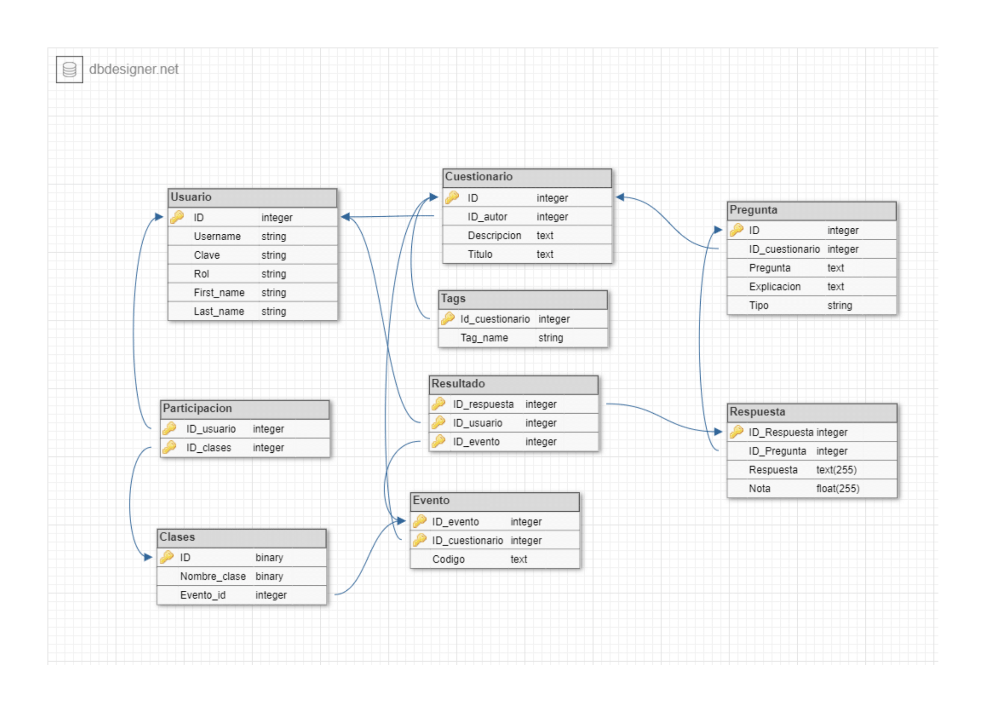

# QUIZZOL
Quizzol es una aplicación que permite realizar cuestionarios online en tiempo real. Los alumnos responden a los cuestionarios desde sus dispositivos, siendo el profesor quien lanza cada pregunta. Los profesores pueden crear cuestionarios o importarlos desde los formatos más populares, también disponen de un catálogo con todos los cuestionarios disponibles para lanzar.

Quizzol es una plataforma que busca la facilidad de los profesores para hacer test a tiempo real con sus alumnos a modo de minijuegos y asi poder ayudar a los alumnos a aprender y a la vez poder evaluar las aptitudes de los alumnos.

## Roles:
### Profesor
Crear clases.
Crear cuestionarios , que podrá consultar en la vista de cuestionarios. También podrá importar cuestionarios ya creados en otros formatos populares.
Lanzar un cuestionario a los alumnos, decidiendo cuando aparecerá cada pregunta.
Poder visualizar el ranking una vez terminado el cuestionario.
Puede realizar todo lo que puede hacer un usuario.
### Alumno
Puede participar en un cuestionario a traves de un link proporcionado por su profesor.
### Administrador
Podrá bloquer y eliminar usuarios por realizar un mal uso de la plataforma.
Tiene control y acceso total a la base de datos.

## Diagrama BD

## Usarios existentes:

| Roles             | Nombre   | Apellidos     | Username   | Contraseña |
|-------------------|----------|---------------|------------|------------|
| ADMIN, ALUMNO     | Admin    | Administrador | a          | aa         |
| ALUMNO, PROFESOR  |          |               | b          | aa         |
| ALUMNO            |          |               | c          | aa         |
| ALUMNO, PROFESOR  | Alberto  | Apellido      | albertinho | aa         |
| ALUMNO, PROFESOR  | Adrian   | Apellido      | adrinho    | aa         |
| ALUMNO, PROFESOR  | Daniel   | Apellido      | danizinho  | aa         |
| ALUMNO            | Gonzalo  | Apellido      | gonzalinho | aa         |
| ALUMNO            | David    | Apellido      | danielinho | aa         |

## Pruebas:
En nuestras prueba se puede ver:
- Creación de un cuestionario.
- Añadir 3 preguntas a este y guardarlo.
- Comprobar que se muestre disponible en el catálogo.
- Acceso al lanzamiento del cuestionario.

## Cosas que no se han podido hacer
Que el cuestionario se lanze por clases, el cuestionario se lanza a todos los usuarios.
El catálogo donde el usuario registrado puede ver los cuestionarios anteriormente lanzados.
Quizás, ha faltado mostrar el ranking después de responder cada pregunta, para así facilitar la labor del docente y fomentar la competición entre los alumnos.

